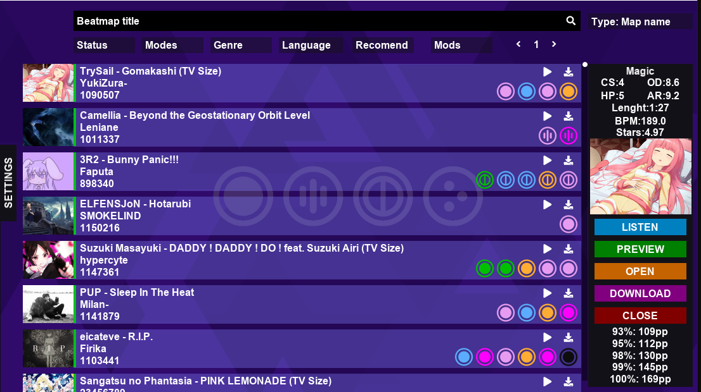

# Fatalny-Direct

Сторонний стендалон Osu! Direct, то есть его аналог, который подсасывается к [chimu.moe](https://chimu.moe/)

Что умеет?
>Тоже самое что и сам chimu.moe, полностью стендалон, то есть без необходимости включать/выключать осу паралельно/отдельно

Чем лучше привычных средств?
>Потребляет меньше ресурсов

Как начать пользоваться?
>Включить и показать в настройке где лежит Osu!.exe (Ну или указать на то что способно будет открыть карты)

## Tillerino !recommend (рекомендованные карты)
**Как настроть?**
1. Зайти на эту страницу https://osu.ppy.sh/p/irc
2. Авторизоваться и получить `Server password `
3. Открыть файл `keys.ini`, который находится в папке с `Fatalny Direct`
4. Вставить между кавычками в `ircName` ваш никтейм из осу(если в никнейме есть пробелы замените их нижним подчеркиванием `my Name -> my_Name`, а еще прочитать вот [это](https://github.com/Tillerino/Tillerinobot/wiki/How-to-fix-%22confusing-name%22-error)), и вставьте ваш `Server password ` (который вы получили) тоже между кавычками в поле `ircPass`
5. Сохраните файл, откройте `Fatalny Direct` и в настройках включите `Tillerino`. У вас появится новая кнопка на которую вы сможете нажимать и она будет вызывать для tillerino комманду `!recommend` и вы получите рекомендацию с возможными результатами

## ppaddict (сколько pp за карту)
**Как настроть?**
**Начиная с версии 1.4.0 не требует настройки(и идти в 8 пункт), api ключ уже вшит в код, однако все еще можно вставить свой ключ апи вместо моего по этой инструкции**
1. Зайти в осу и найти там `Tillerino`
2. Зайти на эту страницу https://ppaddict.tillerino.org/ и залогиниться в ней
3. Нажать кнопку `Settings` и попросить ключ апи
4. Если вы не авторизовывались, то вам выдаст ключ, который нужно отправить в чат `Tillerino`, после этого вы авторизуетесь
5. Нажать `Create api key` 
6. Полученный ключ вставьте в файл `keys.ini`, который находится в папке с `Fatalny Direct` в значение `addictKey` между кавычкми
7. Сохраните файл 
8. Откройте `Fatalny Direct` и в настройках включите `PPaddict`
+ При открытии превью карты стандартного режима вам будут показываться возможные варианты полученных результатов

**[СКАЧАТЬ ОНЛАЙН БЕЗ РЕГИСТРАЦИИ](https://github.com/fataliti/Fatalny-Direct/releases)** 

